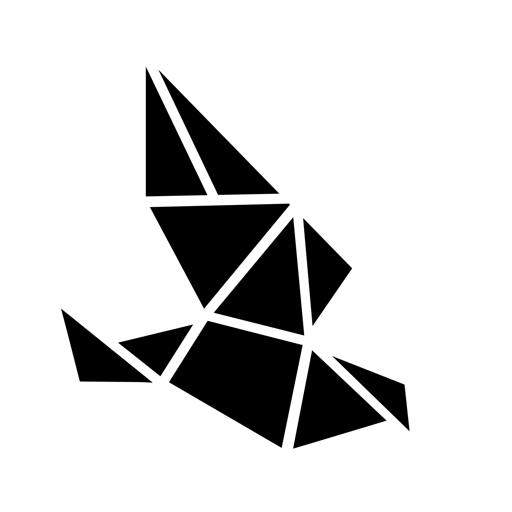

<div align="center">
  <a href="https://github.com/WeirdPtr/skinport-rs/">
    
  </a>
</div>

<div id="top"></div>
<br />
<div align="center">
<h3 align="center">skinport</h3>
  <p align="center">
    Skinport API Bindings for the Rust Programming language.
    <br />
    <br />
    <a href="https://github.com/WeirdPtr/skinport-rs/issues">Report Bug</a>
    ·
    <a href="https://github.com/WeirdPtr/skinport-rs/issues">Request Feature</a>
  </p>
</div>

## About The Project

This crate aims to provide easy to use API bindings for the [Skinport](https://skinport.com) API.

### Basic Example

```rust
#[tokio::main]
async fn main() {
    let client = Client::default();

    let items = client
        .get_sales_out_of_stock(Some(Game::CSGO), Some(Currency::EUR))
        .await;

    println!("{items:#?}");
}
```

## Roadmap

See the [open issues](https://github.com/WeirdPtr/skinport-rs/issues) for a full list of proposed features (and known issues).

## Contributing

If you have a suggestion that would make this better, please fork the repo and create a pull request. You can also simply open an issue with the tag "enhancement".

1. Fork the Project
2. Create your Feature Branch (`git checkout -b feature/AmazingFeature`)
3. Commit your Changes (`git commit -m 'Add some AmazingFeature'`)
4. Push to the Branch (`git push origin feature/AmazingFeature`)
5. Open a Pull Request

## License

Distributed under the MIT or Apache 2 License. See [`LICENSE-MIT`](https://github.com/WeirdPtr/skinport-rs/blob/master/LICENSE-MIT) or [`LICENSE-APACHE`](https://github.com/WeirdPtr/skinport-rs/blob/master/LICENSE-APACHE) for more information.
